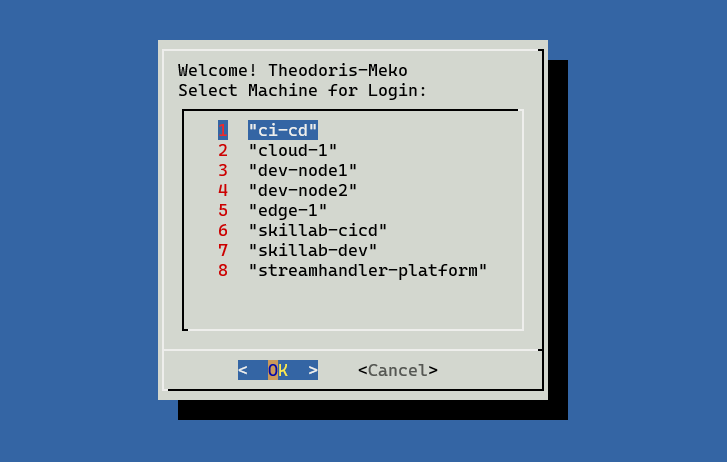

# SSH UI Script 🖥️

## Overview 👀


This script provides a user-friendly dialog-based interface for connecting to SSH hosts defined in your SSH config file. It automatically reads available hosts from `~/.ssh/config` and presents them in an interactive menu for easy selection.

## Features ✨
- Interactive dialog-based user interface
- Automatically reads and parses SSH hosts from `~/.ssh/config`
- Displays a numbered menu of available SSH connections
- Sorts hosts alphabetically for easy navigation
- Clean and simple selection process

## Prerequisites 📋
- Linux/Unix-based operating system
- Bash shell
- `dialog` package installed
- Properly configured `~/.ssh/config` file
- SSH client

### Installing Dependencies 📦
On Debian/Ubuntu systems:
```bash
sudo apt-get install dialog
```

## Usage 🚀
1. [Create or Edit Your ~/.ssh/config](#configuration-)
2. Enable Auto-Completion in Bash
    ```bash
    echo 'complete -W "$(awk "/^Host[[:space:]]+[^*]/ {print \$2}" ~/.ssh/config)" ssh' >> ~/.bashrc
    source ~/.bashrc
    ```
3. To Connect via SSH UI
   ```bash
   apt install dialog
   ```

4. Make the script executable:
   ```bash
   chmod +x ssh-ui-script
   ```

5. Run the script:
   ```bash
   ./ssh-ui-script
   ```

## System-Level Command Installation (Optional) ⚙️
If you want to access the SSH UI from anywhere in your system without executing the script manually, you can create a system-level command.

1. Create a symbolic link to make the script accessible system-wide:
   ```bash
   sudo ln -s "$(pwd)/ssh-ui-script" /usr/bin/ui-ssh
   ```

2. Now you can launch the SSH UI from anywhere using:
   ```bash
   ui-ssh
   ```

This allows you to quickly access your SSH connections menu from any directory without typing the full script path.

## Configuration 🔧
The script automatically reads from your SSH config file (`~/.ssh/config`). Ensure your SSH config file is properly formatted with host entries like:

```
Host hostname1
    HostName example1.com
    User username1

Host hostname2
    HostName example2.com
    User username2
```

## Resources used to build this 📚
[Medium Article](https://medium.com/devsecops-community/ssh-like-a-boss-why-remember-hosts-when-your-terminal-can-do-it-for-you-a7d9f8497548)